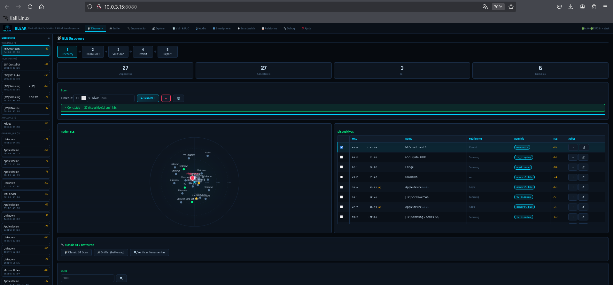

# BLEAK — Bluetooth Link Exploitation & Attack Knowledgebase

> **USO EXCLUSIVO PARA TESTES AUTORIZADOS** — Leia o aviso legal completo abaixo.

   

Plataforma de recon e testes inicias de segurança em Bluetooth BLE/Classic com interface web, exploits ativos CVE e hardware ESP32.


---

## Funcionalidades

| Área | Módulos |
|------|---------|
| **Reconhecimento** | Discovery BLE/BT, Sniffer, GATT Enumeration, Explorer interativo |
| **Análise** | Vulnerability Scanner (15+ checks), Fast Pair Detector, MAC Rotation |
| **Áudio/Exploit** | WhisperPair (CVE-2025-36911), BlueSpy (BSAM-PA-05), RACE/Airoha (CVE-2025-20700) |
| **HID / Spam** | BlueDucky (CVE-2023-45866), BLE Spam Apple/Android/Samsung/Windows |
| **Dispositivos** | Smartwatch (Mi Band, Garmin, Galaxy Watch), Smartphone BLE |
| **Relatórios** | HTML técnico + JSON + CSV, Relatório gerencial executivo |

---

## Instalação Rápida

```bash
git clone https://github.com/seu-usuario/BLEAK.git && cd BLEAK
sudo ./install.sh
sudo ./run_web_lan.sh      # Acesse: http://<SEU-IP>:8080
```

### Requisitos

- Kali Linux 2024+ (recomendado) ou Debian/Ubuntu com BlueZ
- Python 3.12+
- Adaptador Bluetooth USB
- ESP32-C3 ou S3 (opcional — necessário para BLE Spam Android/Samsung)

### Compatibilidade de Hardware

O BLEAK detecta adaptadores e capacidades em tempo de execução. Ele não depende
de uma única configuração fixa, mas cada módulo exige recursos diferentes.

**Perfil mínimo:**

- Kali/Debian/Ubuntu com BlueZ ativo
- Python 3.12+
- Um adaptador Bluetooth exposto como `hci0`, `hci1`, etc.
- Ferramentas básicas: `bluetoothctl`, `hciconfig`, `btmgmt`

Com esse perfil, normalmente funcionam: Discovery BLE/Classic, GATT Explorer,
Vulnerability Scan básico, PoC BLE, Fast Pair scan via BlueZ e geração de
relatórios.

**Perfil completo recomendado:**

- Adaptador HCI USB confiável para BlueZ
- ESP32-C3 ou ESP32-S3 com firmware BLEAK
- PipeWire ou PulseAudio funcional no usuário gráfico
- Ferramentas de áudio: `wpctl`, `pactl`, `pw-record`, `parecord`
- Ferramentas opcionais: `bettercap`, `sdptool`, `hcitool`, `bluez-tools`

Com esse perfil, ficam disponíveis também: Fast Pair scan mais robusto via
ESP32, BLE Spam, Karma, Beacon, MAC Clone, HID via hardware, BlueSpy,
WhisperPair com gravação A2DP/HFP, RACE/Airoha e sniffer.

| Módulo | HCI/BlueZ | ESP32 | PipeWire/PulseAudio | Observações |
|---|---:|---:|---:|---|
| Discovery BLE/Classic | Sim | Não | Não | Um dongle HCI já basta. |
| GATT Explorer / Vuln Scan | Sim | Não | Não | Depende de o device estar conectável. |
| Fast Pair Scanner | Sim | Opcional | Não | ESP32 ajuda a ver anúncios que o BlueZ pode filtrar. |
| WhisperPair verificação | Sim | Opcional | Não | A comprovação pode funcionar sem áudio. |
| WhisperPair gravação | Sim | Não | Sim | Precisa endpoint Classic/A2DP ou HFP visível no BlueZ. |
| BlueSpy | Sim | Não | Sim | Usa `btmgmt`, `bluetoothctl`, `pactl`/`parecord`. |
| BLE Spam / Karma / Beacon | Parcial | Sim | Não | Algumas ações dependem do firmware ESP32. |
| HID Injection | Parcial | ESP32-S3 | Não | Requer hardware/firmware compatível. |
| Sniffer | Parcial | Opcional | Não | Varia conforme adaptador e backend usado. |
| Relatórios | Não | Não | Não | Inclui evidências arquivadas, inclusive áudio. |

**Limitações esperadas em outras máquinas:**

- A porta da ESP32 pode mudar (`/dev/ttyUSB0`, `/dev/ttyACM0`, etc.).
- Dongles diferentes variam muito em suporte BLE, Classic BT e A2DP.
- Em PipeWire/PulseAudio, a comprovação pode funcionar e a gravação falhar se o
  card `bluez_card.*` ou o nó `wpctl` não for criado.
- Fones com MAC rotativo podem aparecer com múltiplos endereços; evidências de
  áudio confirmadas são arquivadas para relatório.
- Se o firmware ESP32 não for o BLEAK esperado, módulos ESP32 podem não responder.

### Instalação manual

```bash
python3 -m venv .venv && source .venv/bin/activate
pip install -r requirements.txt
sudo systemctl start bluetooth
cp .env.example .env          # Configure variáveis opcionais
sudo ./run_web_lan.sh
```

---

## Fluxo de Uso (UX)

As abas seguem ordem lógica de pentest — esquerda → direita:

```
📡 Discovery → 🦈 Sniffer → 🔌 Enum → 🔬 Explorer → 🛡 Vuln & PoC → 🎧 Áudio → 📋 Relatórios
```

1. **Discovery** — Scan BLE/BT, devices aparecem com fingerprint automático
2. **Sniffer** — Captura passiva de tráfego BLE via bettercap
3. **Enumeração** — Deep-dive GATT: serviços, características, valores
4. **Explorer** — Leitura/escrita interativa de características GATT
5. **Vuln & PoC** — Executa checks automáticos e gera scripts PoC
6. **Áudio** — WhisperPair, BlueSpy, RACE, captura A2DP
7. **Relatórios** — Gera relatório técnico ou executivo

---

## Exploits Implementados

### WhisperPair — CVE-2025-36911

Pareamento não autorizado com headphones Fast Pair → captura de áudio A2DP.

```
Device: Redmi Buds, Edifier BLE, outros com Fast Pair (UUID 0xFE2C)
Método: KBP write na char 0xFE2C1236 (sem autenticação)
Resultado: Captura o áudio tocando no headphone da vítima
```

### BlueDucky — CVE-2023-45866

Injeção de teclado BT sem pareamento em Android/Linux.

```
Requer: ESP32-S3 ou BlueDucky instalado em tools/
Payload: DuckyScript-style (STRING, ENTER, GUI r, DELAY ms)
```

### BLE Spam

```
Apple:   Continuity (AirPods, HomePod popups) — via hci0
Android: Fast Pair Service Data UUID 0xFE2C + model ID aleatório — ESP32
Samsung: Galaxy Buds/Watch Fast Pair — ESP32
Windows: Swift Pair manufacturer data 0x0006 — ESP32
```

---

## Hardware ESP32

| Chip | Porta | Firmware | Capacidades |
|------|-------|----------|-------------|
| ESP32-C3 | /dev/ttyACM1 | bleak_esp32_c3_v5.ino | BLE Spam, Karma, Scan, Beacon, MAC Clone |
| ESP32-S3 | /dev/ttyUSB1 | bleak_esp32_s3_v5.ino | Tudo do C3 + USB HID Injection |

```bash
# Identificar portas
lsusb
# 0403:6001 = FT232 (S3) → ttyUSB1
# 303a:0002 = ESP32 CDC (C3) → ttyACM1
# 303a:1001 = JTAG DEBUG → NÃO usar!

# Corrigir permissões
sudo chmod 666 /dev/ttyUSB1 /dev/ttyACM1
```

Flash via Arduino IDE — ver `esp32_firmware/README.md`.

---

## API REST

```bash
curl http://localhost:8080/api/status
curl -X POST http://localhost:8080/api/discovery/start -d '{"timeout":30}' -H "Content-Type: application/json"
curl http://localhost:8080/api/discovery/results

# WhisperPair
curl -X POST http://localhost:8080/api/audio/whisperpair-flow \
  -d '{"mac":"AA:BB:CC:DD:EE:FF"}' -H "Content-Type: application/json"
curl http://localhost:8080/api/audio/whisperpair-status/<job_id>
```

Documentação completa: `docs/API.md`

---

## Segurança

- **Nenhuma chave/token real** incluída no código
- Auth key Mi Band = chave padrão de fábrica (pública) — sobrescreva em `.env`
- `.env` está no `.gitignore` — nunca commite credenciais
- Servidor bind em `0.0.0.0` — use em rede isolada ou com firewall
- Disclaimer legal obrigatório na primeira abertura

---

## Aviso Legal

Esta ferramenta destina-se EXCLUSIVAMENTE a:
- Profissionais de segurança em pentests com escopo autorizado
- Pesquisadores em ambientes de laboratório controlados
- Estudantes em dispositivos próprios ou com autorização

**O uso não autorizado é crime** (Lei 12.737/2012 BR · CFAA EUA · Computer Misuse Act UK).  
Os autores não se responsabilizam por uso indevido.

---

## Referências

- [Google Fast Pair Spec](https://developers.google.com/nearby/fast-pair/specifications)
- [CVE-2025-36911](https://nvd.nist.gov/vuln/detail/CVE-2025-36911) · [CVE-2023-45866](https://nvd.nist.gov/vuln/detail/CVE-2023-45866)
- [ESP32Marauder](https://github.com/justcallmekoko/ESP32Marauder) · [AppleJuice](https://github.com/ECTO-1A/AppleJuice) · [BlueDucky](https://github.com/pentestfunctions/BlueDucky)
